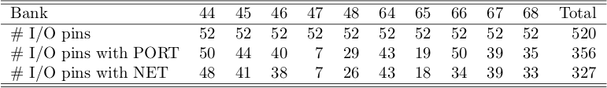

# Scripts to extract `PACKAGE_PIN` information from Vivado project
Scripts extracts `PACKAGE_PIN` information into a text table file from an implemented firmware design in a Vivado project and produces summary latex tables.

Description of `report_package_pins.tcl` and `analyze_report.py` are given below.

`report_package_pins.tcl`: Makes a file containing a text table with `PACKAGE_PIN`, `PIN_FUNC`, `SITE`, `SITE_TYEP`, `BANK`, `DIRECTION`, `PORT`, `NET` columns from an implemented firmware design in Vivado.

`analyze_report.py`: Produces summary tables of pins by analyzing `report_package_pins.tcl` output file. Tables are written in latex.

Below summary tables are produced by `analyze_report.py`: 

- `table_pin_count_by_type.tex`  
    Table of `PACKAGE_PIN` count by type of pin. Counts all pins, pins connected to `PORT`, and pins connected to `NET`.  
    Priority of assigning type of pins is shown below (left is highest, right is lowest). 
    - types of pin: `I/O`, `MGT rx/tx`, `MGT refclk`, `Config`, `Monitor`, `Power/GND`, `Not Connected`  
    
- `table_io_pin_count_by_bank.tex`  
    Table of `I/O` `PACKAGE_PIN` count by FPGA bank.
    Counts all `I/O` pins, `I/O` pins connected to `PORT`, and `I/O` pins connected to `NET`.

- `table_port_with_no_net.tex`  
    Table of `PORT`s (with pin) that are not connected to `NET`.
    

# Example table outputs

Example text table from `report_package_pins.tcl`

Example latex tables from `analyze_report.py`

- `table_pin_count_by_type.tex`  

- `table_io_pin_count_by_bank.tex`  

- `table_port_with_no_net.tex`  

# Running scripts
## Running `report_package_pins.tcl` script
There are two methods of running `report_package_pins.tcl` script

### Method 1: Run tcl script in Vivado batch mode with arguments

`vivado -nojournal -nolog -mode batch -source report_package_pins.tcl -tclargs PATH_TO_PROJECT.xpr DESIGN_NAME OUTPUT_FILENAME`

[Note] `DESIGN_NAME` is implemented design name in Vivado and `OUTPUT_FILENAME` is the filename of the text table file.

Example:  
`vivado -mode batch -source report_package_pins.tcl -tclargs project.xpr impl_1 report_package_pins.txt`

### Method 2: Run tcl script in Vivado tcl mode with arguments

`vivado -mode tcl`  
`set argc 3`  
`set argv [list PATH_TO_PROJECT.xpr DESIGN_NAME OUTPUT_FILENAME]`  
`source report_package_pins.tcl`

## Running `analyze_report.py` script

Requires `report_package_pins.tcl` output text table file which is represented as `REPORT_FILENAME` below.

Run below command:  
`analyze_report.py --input_report_filename REPORT_FILENAME`  

Example:   
`analyze_report.py --input_report_filename report_package_pins.txt`
